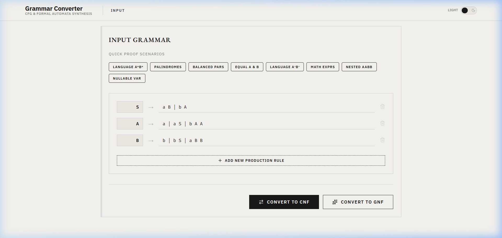
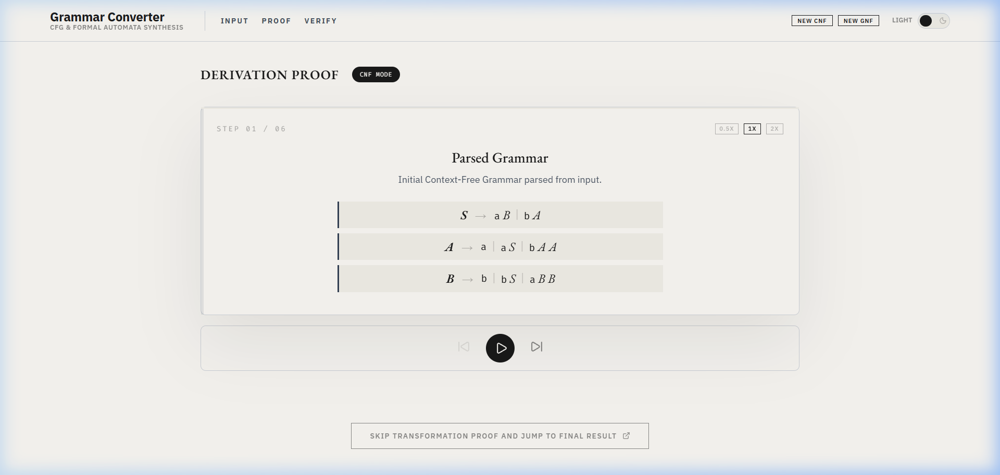
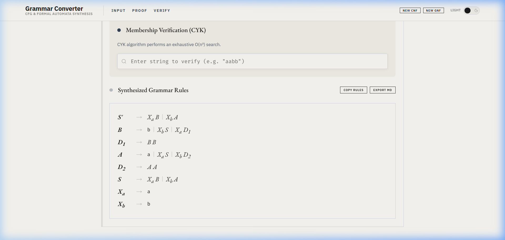

# TAFL Grammar Transformation Tool

A high-fidelity, interactive educational platform designed for the visualization and mathematical synthesis of Context-Free Grammars (CFG) into **Chomsky Normal Form (CNF)** and **Greibach Normal Form (GNF)**.

## 🖼️ Visual Overview

### 1. Unified Interface
A clean, glassmorphic design optimized for academic research and rule definition.


### 2. Step-by-Step Derivation
Detailed proof traces showing every mathematical transformation (Simplification, Unit Removal, Nullable Elimination, etc.).


### 3. Verification & Synthesis
Final synthesized ruleset with an integrated membership verification suite (CYK Algorithm & Recursive Matching).


## 🚀 Key Features

- **Mathematical Proof Engine**: Automated conversion of arbitrary CFGs into CNF and GNF with real-time derivation snapshots.
- **Interactive Membership Testing**: Verify if strings are part of the language $L(G)$ using the CYK algorithm (for CNF) and grammar matching (for GNF).
- **Formal Expression Rendering**: Rules are rendered with proper mathematical notation for clarity.
- **Academic Export**: Direct export of transformation proofs to Markdown for inclusion in reports.
- **Educational Mode**: Tailored for students and enthusiasts of Theory of Automata and Formal Languages.

## 🛠️ Tech Stack

- **Frontend**: React 19 (Vite)
- **Styling**: Modern Vanilla CSS (Custom Design System)
- **Animations**: Framer Motion for high-quality transitions.
- **Math Logic**: Custom Grammar Simulation Engine.
- **Icons**: Lucide React.

## 📥 Installation & Setup

1. **Clone the repository**:
   ```bash
   git clone https://github.com/LakshAgrawal28/TAFL.git
   ```
2. **Navigate to the directory**:
   ```bash
   cd TAFL
   ```
3. **Install dependencies**:
   ```bash
   npm install
   ```
4. **Launch the development environment**:
   ```bash
   npm run dev
   ```

## 📖 Operational Guide

1. **Input Rules**: Define your grammar using standard notation (e.g., `S -> aS | b`).
2. **Select Protocol**: Choose between **CNF** or **GNF** transformation pipelines.
3. **Verify Steps**: Trace the derivation through the animated proof sequencer.
4. **Test Strings**: Use the Verification Suite to test arbitrary strings against the target grammar.

---
Developed for Academic Excellence in Formal Languages.
